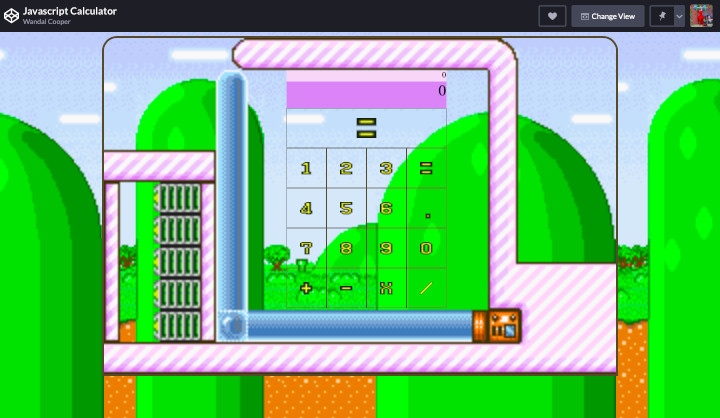

# [JavaScript Calculator](https://codepen.io/wmcooper2/full/jOOWVVg)
A calculator made using JavaScript.

## Purpose/Goal
The goal was to figure out how to work with expressions, conditionals and more to make a functioning calculator where the logic is written entirely in vanilla JavaScript.

## Operation
Click on the calculator's keys and calculate simple expressions.

## Tech/Libraries Used
* HTML
* CSS
* JavaScript
* React

## Problems/Solutions
* There were many small challenges with trying to parse something on my own. I relied on regular expressions, and conditionals to make the expressions work properly.

## More Information
N/A
